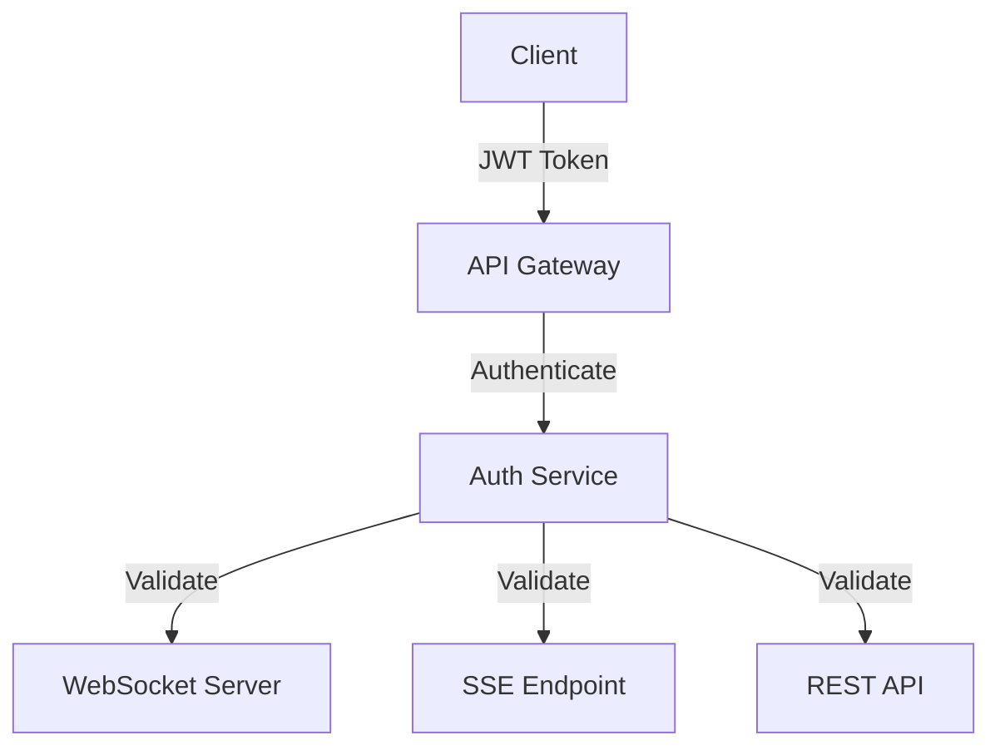
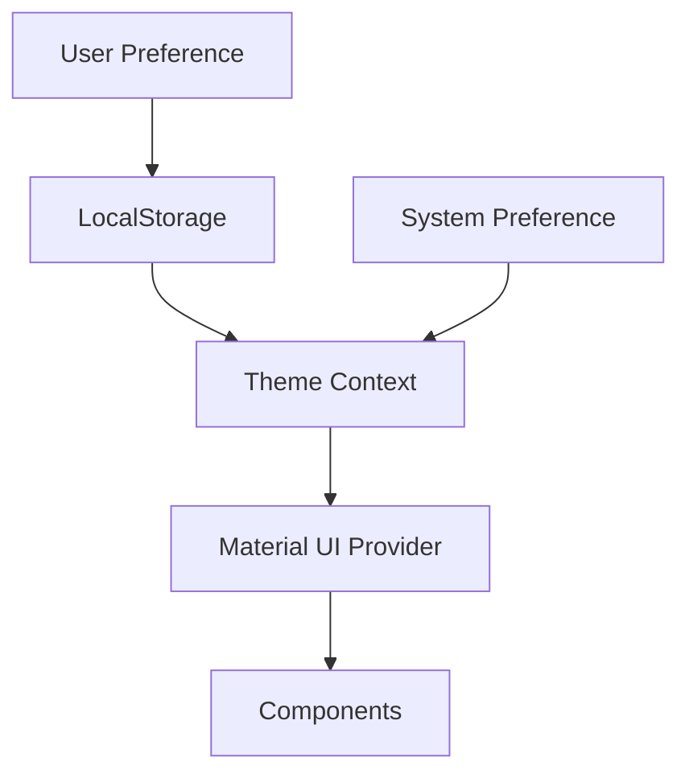
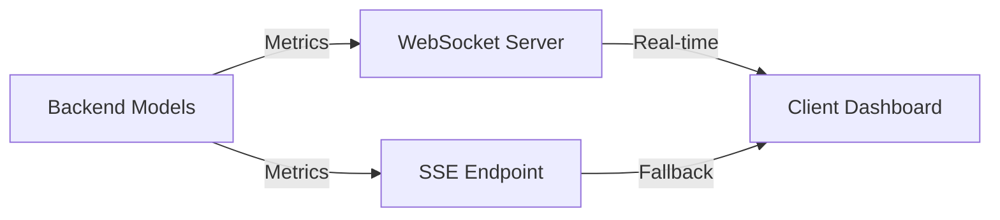

# Next.js Llama Async Proxy - Codebase Research Findings

## IMPORTANT SECURITY NOTICE

**🚨 AUTHENTICATION IS STRICTLY FORBIDDEN IN THIS PROJECT 🚨**

This application is designed for PUBLIC ACCESS with NO authentication mechanisms. All WebSocket, SSE, and API endpoints are intentionally open and accessible without credentials. This is a deliberate architectural decision for the project's specific use case.

## Executive Summary

This is a sophisticated Next.js application designed as a dual proxy for LM Studio and Ollama backends, with enterprise-grade audio capabilities powered by faster-whisper. The application features real-time monitoring, model management, and advanced analytics through WebSocket and SSE technologies.

**Key Design Principle**: Public access without authentication

## Architecture Overview

### Core Components

1. **Server Infrastructure**: Custom HTTP server with Socket.IO integration (`server.js`)
2. **Next.js Configuration**: Optimized for production with advanced features (`next.config.ts`)
3. **Theme System**: Dual theme support with Material UI integration
4. **Real-time Data**: WebSocket and SSE implementations for live metrics
5. **State Management**: Zustand-based global store

## Detailed Findings

### 1. Server & Networking

#### WebSocket Implementation (`server.js`, `websocket-service.ts`)

**Strengths:**
- Robust Socket.IO integration with automatic reconnection
- Comprehensive event handling (connect, disconnect, error states)
- Periodic metrics collection (every 10 seconds)
- Client count tracking and uptime monitoring

**Issues Found:**
- **Security**: No authentication/authorization in WebSocket connections
- **Error Handling**: Limited error recovery mechanisms
- **Scalability**: No rate limiting or connection throttling
- **Data Validation**: No input validation for WebSocket messages

**Key Files:**
- `server.js`: Main HTTP server with Socket.IO
- `src/services/websocket-service.ts`: Client-side WebSocket service
- `src/providers/websocket-provider.tsx`: React context provider

### 2. Theme System

#### Theme Implementation (`ThemeContext.tsx`, `theme.ts`)

**Strengths:**
- Comprehensive design token system with color palettes
- System preference detection and automatic switching
- LocalStorage persistence for user preferences
- Material UI integration with custom components
- Smooth transitions and animations

**Issues Found:**
- **SSR Mismatch**: Potential hydration issues with theme detection
- **Performance**: Multiple useEffect hooks could cause unnecessary re-renders
- **Accessibility**: No contrast ratio validation
- **Testing**: Incomplete test coverage for edge cases

**Key Files:**
- `src/contexts/ThemeContext.tsx`: Main theme context
- `src/styles/theme.ts`: Design tokens and theme definitions
- `src/components/ui/ThemeToggle.tsx`: Theme switching UI

### 3. Real-time Data

#### SSE Implementation (`pages/api/sse.ts`)

**Strengths:**
- Proper SSE headers and connection management
- Fallback mechanism for metric collection
- Regular data updates (1 second interval)
- Error handling and cleanup

**Issues Found:**
- **Security**: No authentication for SSE endpoint
- **Performance**: Hardcoded 1-second interval may be too aggressive
- **Error Recovery**: Limited error handling for client disconnections
- **CORS**: Overly permissive CORS settings

### 4. API & Configuration

**Current State:**
- Basic middleware for request logging (`src/middleware.ts`)
- No REST API routes found (only SSE endpoint)
- Empty auth.ts file (authentication is intentionally absent)
- Public access design with permissive CORS

**Critical Issues:**
- **Missing API Routes**: No RESTful endpoints for core functionality
- **Limited Validation**: No comprehensive request validation
- **Configuration Issues**: Hardcoded settings and intervals
- **No Rate Limiting**: Potential for abuse (intentional for public access)

### 5. Testing Infrastructure

**Current State:**
- Jest configured with Next.js integration
- Basic test setup for theme context
- Limited component testing
- No integration or end-to-end tests

**Issues Found:**
- **Incomplete Coverage**: Only 2 test files found
- **Mocking Issues**: Incomplete localStorage and matchMedia mocks
- **No API Testing**: No tests for WebSocket or SSE functionality
- **No Performance Testing**: No load or stress tests

## Technical Debt Analysis

### High Priority Issues

1. **Theme System Issues**
   - Potential SSR hydration mismatches
   - Incomplete accessibility compliance
   - Performance optimization needed

2. **Missing Core Functionality**
   - No REST API endpoints
   - Limited error handling and validation
   - Incomplete testing infrastructure

3. **Configuration Issues**
   - Overly permissive CORS settings (intentional for public access)
   - Hardcoded polling intervals
   - Limited connection management

### Medium Priority Issues

1. **Testing Gaps**
   - Incomplete test coverage
   - No integration tests
   - No performance tests

2. **Error Handling**
   - Limited WebSocket error recovery
   - Basic SSE error handling
   - No circuit breakers

3. **Performance Optimization**
   - Aggressive SSE polling interval
   - No connection throttling
   - Limited caching strategies

## Recommended Action Plan

### Phase 1: API Development (Critical)

**Tasks:**
1. Create REST API routes for core functionality
2. Implement model management endpoints
3. Add monitoring data endpoints
4. Create configuration APIs
5. Add proper request validation (without authentication)

**Estimated Time:** 5-7 days
**Priority:** HIGH

### Phase 2: Theme System Enhancement

**Tasks:**
1. Fix SSR hydration issues
2. Add accessibility validation
3. Optimize performance
4. Complete test coverage
5. Add user preference management

**Estimated Time:** 2-3 days
**Priority:** HIGH

### Phase 3: Theme System Enhancement

**Tasks:**
1. Fix SSR hydration issues
2. Add accessibility validation
3. Optimize performance
4. Complete test coverage
5. Add user preference management

**Estimated Time:** 2-3 days
**Priority:** MEDIUM

### Phase 4: Testing Infrastructure

**Tasks:**
1. Complete unit test coverage
2. Add integration tests
3. Implement end-to-end tests
4. Add performance testing
5. Set up CI/CD pipeline

**Estimated Time:** 4-6 days
**Priority:** MEDIUM

### Phase 5: Performance Optimization

**Tasks:**
1. Implement connection throttling
2. Add intelligent polling intervals
3. Implement caching strategies
4. Add circuit breakers
5. Optimize WebSocket reconnection logic

**Estimated Time:** 3-4 days
**Priority:** LOW

## Architecture Recommendations

### 1. Security Architecture

### 2. Theme System Architecture

### 3. Real-time Data Flow

## Implementation Strategy

### Team Assignment

1. **Security Team**: Focus on authentication and authorization
2. **API Team**: Develop REST endpoints and validation
3. **Frontend Team**: Enhance theme system and UI components
4. **QA Team**: Develop comprehensive test suite
5. **DevOps Team**: Set up CI/CD and monitoring

### Timeline

- **Week 1**: Security implementation and basic API routes
- **Week 2**: Complete API development and theme enhancements
- **Week 3**: Testing infrastructure and performance optimization
- **Week 4**: Final integration and deployment

## Risk Assessment

### High Risks

1. **Security Vulnerabilities**: Current lack of authentication poses significant risk
2. **Data Integrity**: No validation could lead to corrupted state
3. **Performance Issues**: Aggressive polling could overload backend

### Mitigation Strategies

1. **Immediate Security Patch**: Implement basic authentication
2. **Input Validation**: Add comprehensive data validation
3. **Performance Monitoring**: Implement real-time monitoring

## Conclusion

The Next.js Llama Async Proxy has a solid foundation but requires attention to missing core functionality. **IMPORTANT: Authentication is strictly FORBIDDEN in this project.** The recommended action plan focuses on enhancing existing capabilities while respecting this constraint.

**Next Steps:**
1. Begin API development (without authentication)
2. Enhance theme system and UI components
3. Implement comprehensive testing framework
4. Optimize performance and real-time data handling
5. Monitor and improve overall architecture